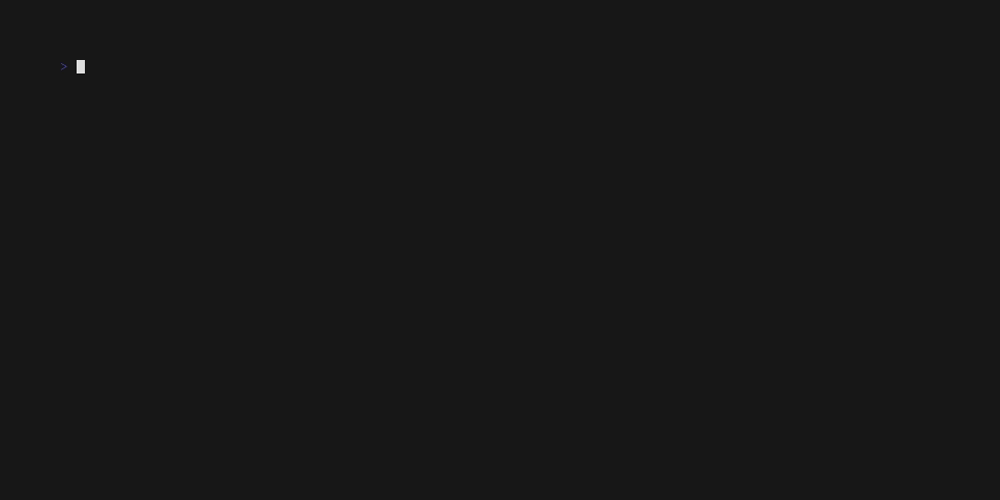

# Chess Replay Program

## Overview

This project is a Chess Replay Program written in C. It reads a text file formatted according to the Lichess.org database model and simulates the game move by move, displaying the board state after each move. The program also provides additional information such as move evaluations and comments, provided by the txt file.

## Features

- **Game Parsing**: Reads a chess game from a text file in Lichess format.
- **Board Simulation**: Simulates the game move by move, updating the board state.

## How It Works

The program consists of several modules:

1. **read_game.c**: Reads the game file and parses the moves and headers.
2. **parse_move.c**: Parses individual moves and extracts relevant information.
3. **update_board.c**: Updates the chess board based on the moves.
4. **write_move.c**: Writes the move details to the console.
5. **print_board.c**: Prints the current state of the chess board.
6. **main.c**: The main driver program that orchestrates the reading, parsing, and simulation of the game.
7. etc.

## Usage

To run the program, compile the source files. 
To tweak the display speed, provide as argument the interval time in seconds : 

```bash
make
./chess 1
```
This will compile the program, and run it with 1 second of delay between each move.
Edit the read_game function in the read_game.c line to open any txt file formatted according to the Lichess.org database model

## Demo 



*Demo created with [VHS](https://github.com/charmbracelet/vhs)*

## Requirements

- C Compiler (e.g., GCC)
- Standard C Library

## Future Improvements

- **GUI Integration**: Add a graphical user interface to visualize the board and moves.
- **Fully playable chess game**: Allow users to interactively play through the game.

---

Feel free to contribute to this project by submitting issues or pull requests. Enjoy replaying your chess games!
